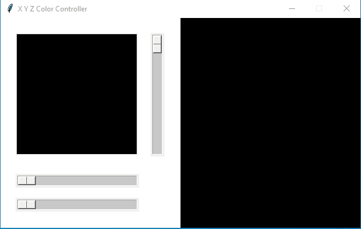
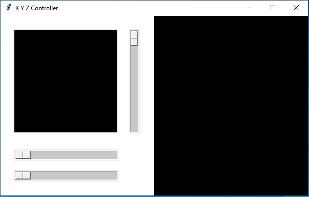
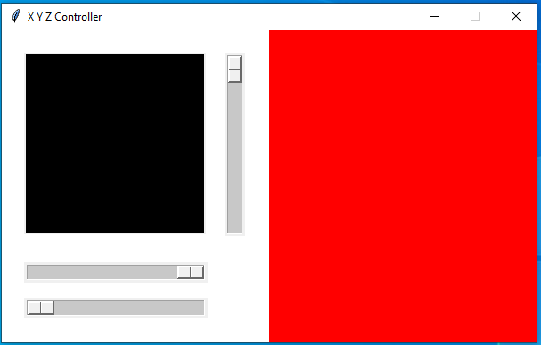
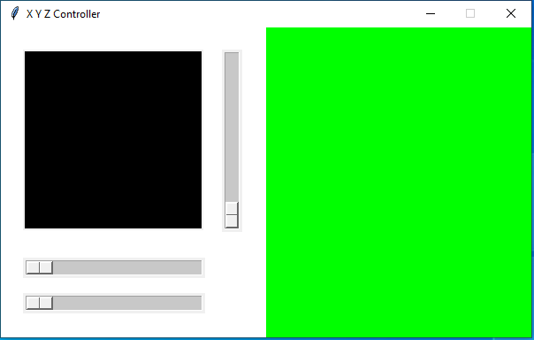
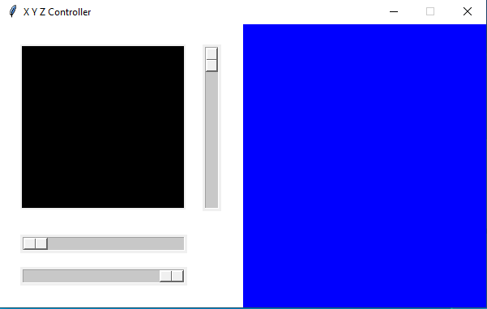
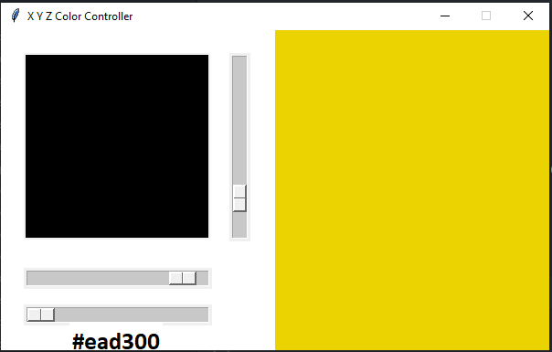

# XYZ-Color-Controller-Tkinter
This is a Tkinter App, that let's you change color when you adjust the slider positions.

## UI

Has three sliders and two rectangular area. First slider below the black rectangle is **X Slider** and controls **RED** in the RGB spectrum, the one right to the black rectangle is the **Y Slider** and controls the **Green** in RGB and the bottom most slider is **Z Slider** and controls the **Blue** color in RGB. The **Black Rectangle on the left translates the mouse position to X and Y values, that is given to the sliders X and Y respectively.** The area on the right displays the current RGB color combination.

## Code
The app with proper geometry and widgets is initialized. **X,Y,Z** are three variables of the class **IntVar** and **bg** is of **StringVar()** that stores the rgb value as a hex_code. All sliders are bound to update their respective IntVars, and the show method updates the StringVar and the same is used to assign to the **Background Color** parameter of the rectangular area on the right side.

## How to run it
1. Download **xyzcontroller.py**
2. Open Terminal/CMD and CD to the downloaded directory
3. Type **python xyzcontroller.py** in the terminal/cmd and Voila!

## Requirements
1. Python 3.7 or Above
2. Tkinter

# Update
## Hex Code Label

# Thank You
